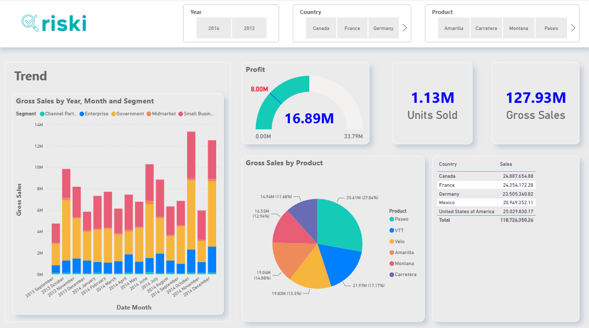

# Sales Performance Dashboard

A Power BI dashboard developed to analyse sales performance across products, countries, customer segments and time periods.

The report provides an executive overview of key commercial metrics, including Gross Sales, Profit and Units Sold, while allowing users to explore performance through interactive filters.

<a href="https://app.powerbi.com/view?r=eyJrIjoiODRjNDZlYTQtOTA3Zi00MjMxLTgyMTktOTcxNGUzMGU1NjdkIiwidCI6IjM1ODAxOWMyLWZmMWQtNGRlOC04MDBlLTk2YTRkMzgwNzMwYyIsImMiOjl9" rel="nofollow">Click here to open the Sales Performance Dashboard</a>

## Key Insights

- Sales performance over time by month and customer segment
- Gross sales contribution by product
- Sales performance by country
- Overall profit, gross sales and units sold
- Interactive analysis by year, country and product

## Dashboard Features

- KPI cards for Gross Sales, Profit and Units Sold
- Monthly sales trend analysis
- Product performance comparison
- Country-level sales analysis
- Interactive slicers for Year, Country and Product

## Tools

- Power BI
- DAX
- Data Modeling
- Data Visualization

## Dashboard Preview

