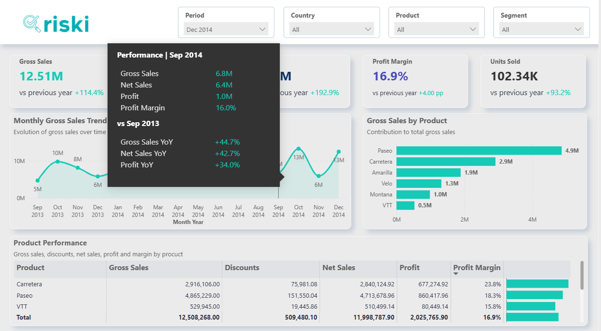

# Sales Performance Dashboard

A Power BI dashboard designed to analyse sales performance across products, countries, customer segments and selected time periods.

The report provides an executive overview of key commercial metrics, including **Gross Sales, Net Sales, Profit, Profit Margin and Units Sold**, while allowing users to explore performance through interactive filters.

It also includes **custom report page tooltips** to provide additional context, such as monthly year-over-year comparisons and product-level performance details.

[Click here to open the Sales Performance Dashboard](https://app.powerbi.com/view?r=eyJrIjoiODRjNDZlYTQtOTA3Zi00MjMxLTgyMTktOTcxNGUzMGU1NjdkIiwidCI6IjM1ODAxOWMyLWZmMWQtNGRlOC04MDBlLTk2YTRkMzgwNzMwYyIsImMiOjl9)

## Key Insights

- Sales performance over time through a monthly trend view
- Gross sales contribution by product
- Product-level profitability and margin analysis
- Comparison of commercial performance across countries and customer segments
- Year-over-year comparison for selected periods
- Detailed product performance including discounts, net sales and profit margin

## Dashboard Features

- KPI cards for **Gross Sales, Net Sales, Profit, Profit Margin and Units Sold**
- Monthly gross sales trend analysis
- Product contribution comparison
- Product performance matrix with **Gross Sales, Discounts, Net Sales, Profit and Profit Margin**
- Custom report page tooltips with additional detail and YoY comparisons
- Interactive slicers for **Period, Country, Product and Segment**

## Tools

- Power BI
- DAX
- Data Modeling
- Data Visualization

## Dashboard Preview

